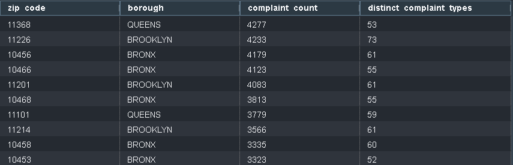

# NYC Business Analytics Pipeline

An end-to-end ELT pipeline that ingests NYC Open Data (business licenses, 311 service requests, PLUTO tax lot data) from the Socrata API, stores it in S3, exposes it to Redshift via schema-on-read (Glue + Spectrum), and transforms it into analysis-ready tables with dbt. It is fully orchestrated by Airflow, with all infrastructure defined in Terraform.

**The question it answers:** where in NYC do licensed businesses generate the most 311 complaint activity relative to how many businesses are actually there and is that driven by business density, or by the built environment (building age, zoning, land/lot-value)?

## Architecture

- Socrata API containing the datasets
- Airflow DAG 
    - Extract datasets (Issued Licenses, 311 Requests and PLUTO)
    - Stored into S3 as a parquet file
    - Glue Crawler reads parquet file gets schema to populate Glue Catalog
    - Redshift 
        - Gets schema info from Catalog and ingest file from S3
- dbt
    - Staging models created, grabs necessary rows from Redshift
    - Mart models created from staging models

## Tech stack

- Terraform - deploys AWS resources/services (S3, Redshift, IAM, Glue, VPC)
- Apache Airflow - Orchestrates extraction, Glue and Redshift data ingestion
- Docker/Docker Compose - containerization of Airflow and dbt
- Redshift - Data warehouse for raw and dbt staging/mart models
- dbt - Data transformation (staging/mart layers)


## Project structure

```
terraform/          All AWS infrastructure (S3, IAM, Redshift Serverless, Glue, VPC)
extract/            Python extraction script + per-dataset config + local env vars
dags/               Airflow DAG orchestrating extraction, verification, transformation
dbt/                Staging + mart SQL models, run against Redshift
docker-compose.yml  Set up Airflow init, scheduler and webserver. Has Postgres server for metadata for Airflow
Dockerfile          Custom Airflow image (extraction deps + isolated dbt environment)
```

## Setup

AWS account, Access/Secret Key (Requires setting up credentials into your AWS CLI)
Terraform
Docker + Docker Compose
Socrata account

In the extract folder, you need an .env with the following:
- Socrata API Key
- Socrata Secret Key
- Socrata Soda3 URL (https://data.cityofnewyork.us/api/v3/views)
- S3 Bucket name
- S3 raw data folder name
- S3 checkpoint folder name
- Glue Crawler name
- Glue Catalog database name
- Redshift Workgroup name
- Redshift Database name
- Redshift Spectrum role ARN
- Redshift Workgroup Endpoint
- Redshift Admin username
- Redshift Admin password
    - Use the randomized password found after running terraform using this command``` terraform output -raw redshift_admin_password ```
    - Or use your own password, make sure to change the terraform file to reflect that

In terraform folder, you will need a terraform.tfvars file with the following:
- aws_region
- environment 
- project_name
- my_ip_cidr (where the machine is running from)
- data_bucket_name
- nyc_business_analytics (name of project)

You may also change the credentials for the airflow-init in docker-compose.yml 
Once setup, you can run the following commands.

```bash
# 1. Deploy Infrastructure
terraform init && terraform apply

# 2. Build and start containers
docker compose build && docker compose up airflow-init && docker compose up -d

# 3. Run Airflow
# open http://localhost:8080 (airflow/airflow) and trigger the DAG

# 4. Trigger dbt
docker compose exec airflow-scheduler bash 
/opt/dbt-venv/bin/dbt run --project-dir /opt/airflow/dbt --profiles-dir /opt/airflow/dbt
/opt/dbt-venv/bin/dbt test --project-dir /opt/airflow/dbt --profiles-dir /opt/airflow/dbt
```

## Where to see results
1. Log into AWS Console and search for Redshift
2. Click the namespace/workgroup 
3. Click on 'Query Data' on the top right, click on 'Query in Query editor v2'
4. Login to the workgroup, then you can run queries against your mart models
```
    SELECT * FROM database_name.public_marts.mart_complaints_by_zip ORDER BY complaint_count DESC LIMIT 10;
```



## Teardown

```bash
docker compose down -v
cd terraform && terraform apply && terraform destroy
```